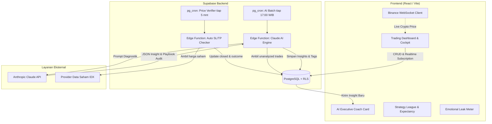

# Product Requirements Document (PRD)
## Trading Journal & My Analysis/Prediction App

**Versi:** 2.1  
**Status:** Approved Draft  
**Terakhir diperbarui:** September 2026  

**Changelog dari v2.0:**
1. **Solusi Anti-Strategy Hopping:** Penambahan modul **"Strategy Playbook"** dengan *Sample Size Tracker* (target minimal komitmen uji 20 trade) agar user tidak terburu-buru ganti strategi sebelum datanya valid secara statistik.
2. **Indikator Disiplin Eksekusi:** Penambahan toggle `followed_plan` (Sesuai Rencana: Ya/Tidak) pada form input untuk membedakan antara strategi yang gagal vs eksekusi emosional/ceroboh.
3. **Metrik Profitabilitas Lanjutan:** Menghitung otomatis **Planned vs Realized R:R (Risk-to-Reward)** dan **Mathematical Expectancy** per strategi, bukan sekadar Win Rate semata.
4. **AI Insight Diperkaya & Ditampilkan di Dashboard:**
   - *AI Executive Coach Briefing* (Widget kartu highlight harian/mingguan di puncak dashboard).
   - *Emotional Leak Detector* (Menghitung nominal uang yang hilang akibat emosi: FOMO, Revenge Trading, dll).
   - *Execution Gap Analyzer* (Kesenjangan cut profit kecepetan vs target R:R awal).
   - *Strategy League Table* (Peringkat performa strategi berdasarkan Expectancy).

---

## 1. Latar Belakang

Trader sering mengalami **"Strategy Hopping"** (kebiasaan gonta-ganti strategi setelah 2–3 kali loss beruntun). Hal ini diperparah oleh:
- Mencatat trade di spreadsheet tanpa pembanding strategi yang terstandarisasi.
- Mengandalkan **Win Rate** sebagai satu-satunya tolok ukur sukses, padahal strategi dengan Win Rate 40% tapi R:R 1:3 jauh lebih menguntungkan dibanding Win Rate 70% tapi R:R 1:0.5.
- Tidak adanya pemisah antara **"strateginya yang salah"** vs **"eksekusinya yang melanggar aturan sendiri (FOMO/Revenge)"**.
- Analisa teknikal ditulis terpisah dan tidak pernah teruji secara otomatis dengan pergerakan harga riil.

Aplikasi ini hadir untuk memutus siklus tersebut. Melalui sistem pencatatan jurnal berbasis **Playbook**, verifikasi otomatis harga riil, serta **AI Daily Insight** yang mendiagnosis kebocoran psikologis dan efektivitas strategi, trader mendapatkan kompas objektif berbasis data matematika.

---

## 2. Tujuan Produk

- **Menghentikan Strategy Hopping:** Membantu trader menguji strategi secara disiplin dengan kuota sampel (mis. 20 trade) dan komparasi matematis (*Expectancy* & R:R).
- **Verifikasi Status Otomatis:** Memantau SL/TP (jurnal) dan target/invalidation (prediksi) secara otomatis tanpa update manual.
- **Deteksi Kebocoran Finansial (Emotional Leak):** Menghitung secara transparan berapa nominal kerugian yang diakibatkan oleh keputusan emosional (FOMO, balas dendam, tidak patuh SOP).
- **Dashboard Cerdas & AI Actionable:** Menyajikan insight harian (batch 17:00 WIB) langsung di dashboard berupa kartu briefing, skor disiplin, dan peringkat strategi terbaik.
- **Efisiensi Biaya AI:** AI dipanggil maksimal 1-2 kali per hari per user secara batch, menekan biaya operasional serendah mungkin ($0 jika tidak ada trade baru).

### 2.1 Non-Goals (di luar cakupan versi ini)
- Tidak menjadi platform eksekusi order (bukan terhubung langsung ke broker/exchange untuk open posisi).
- Tidak menargetkan skala institusional pada versi awal.
- **Rekomendasi coin/pair otomatis sesuai setup strategi (Screener OHLCV):** Ditunda ke fase lanjutan (Fase 5).

---

## 3. Target Pengguna

- **Primer:** Individual trader saham IDX dan/atau crypto yang ingin menghentikan siklus gonta-ganti strategi, membangun konsistensi, dan mengenali kelemahan psikologinya melalui data.
- **Sekunder:** Multi-user (fase berikutnya) yang membutuhkan tools jurnaling dan evaluasi AI personal.

---

## 4. Ruang Lingkup Fitur

### 4.1 Modul 1 — Strategy Playbook (Fondasi Anti-Hopping)

Sebelum mencatat trade, user dapat mendefinisikan strategi utama mereka ke dalam Playbook.

**Field Strategi:**
- **Nama Strategi:** Contoh: *Breakout Retest, Supply-Demand Reversal, Trend Following EMA, SnR Bounce*.
- **Deskripsi & SOP:** Ringkasan aturan entry, konfirmasi, dan exit.
- **Target Sample Size:** Default 20 trades (bisa disesuaikan).
- **Status:** *Testing* (jumlah trade < target sample), *Active* (sudah tervalidasi), *Archived* (dipensiunkan).

---

### 4.2 Modul 2 — Trading Journal

**Form Input Jurnal:**

| Field | Tipe | Keterangan |
|---|---|---|
| Jenis aset | Pilihan | Crypto / Stock (menentukan pair & sumber data) |
| Pair | Pilihan | Contoh: `BTCUSDT`, `BBCA` |
| Strategi | Dropdown | Dipilih dari **Strategy Playbook** milik user (atau "Tanpa Strategi / Eksperimen") |
| Sesuai Rencana? | Toggle (Yes/No) | Apakah entry ini 100% mematuhi aturan strategi? |
| Size | Angka + Mata Uang | Nominal posisi (IDR / USD) |
| Entry | Angka | Harga masuk posisi |
| TP (Take Profit) | Angka | Harga target keluar profit |
| SL (Stop Loss) | Angka | Harga batas keluar rugi |
| Planned R:R | Kalkulasi otomatis | Dihitung otomatis: `\|TP - Entry\| / \|Entry - SL\|` |
| Psikologi | Dropdown (daftar tetap) | Emosi saat entry: *Percaya diri, Takut, Serakah, FOMO, Balas dendam, Sabar, Ragu-ragu, Netral* |
| Alasan & Catatan | Freetext | Catatan teknikal bebas (support, indikator, market structure). Dibaca oleh AI harian |

**Daftar Tetap Psikologi:**
*Percaya diri · Takut · Serakah · FOMO · Balas dendam (revenge trading) · Sabar · Ragu-ragu · Netral*

**Status & Lifecycle:**
- **Open (Proses):** Posisi terbuka, belum menyentuh SL/TP.
- **Closed:** Posisi tertutup otomatis jika SL/TP tersentuh, atau ditutup manual oleh user.
  - Menghasilkan label **Win** atau **Lose**.
  - Menghitung **Realized P/L** dan **Realized R:R**.

---

### 4.3 Modul 3 — My Analysis / Prediction

Mencatat setup analisa sebelum entry: Pair, Arah (Bullish/Bearish), Level Support/Resistance, Target Price, Invalidation Price, Tag Teknik Analisa, dan Catatan.
- Status: `pending` $\rightarrow$ `success` / `fail` (divalidasi otomatis berkala tiap 5 menit terhadap harga riil).

---

### 4.4 Modul 4 — Dashboard & AI Visual Widgets

Dashboard dirancang sebagai *cockpit* evaluasi trader yang menampilkan visualisasi kaya estetika dan actionable:

#### A. AI Executive Briefing (Top Widget)
- Muncul di posisi paling atas dashboard.
- Rangkuman harian/mingguan dari AI:
  - **Status Hari Ini:** *"Hari ini 3 trade tertutup: 2 Win, 1 Lose. Net P/L +Rp 420.000."*
  - **Discipline & Hopping Diagnosis:** *"Bagus! 3 dari 3 trade mengikuti SOP 'Breakout Retest'. Kamu tidak berpindah strategi meski trade pertama menyentuh SL."*
  - **Pesan AI Coach Besok:** *"Tetap fokus pada setup retest. Hindari entry jika target R:R di bawah 1:1.5."*

#### B. Strategy League Table (Peringkat Strategi)
Tabel komparasi performa strategi milik user:
- **Nama Strategi**
- **Sample Progress:** Progress bar (misal `8/20 trades`) + Badge `[Data Belum Cukup - Uji Terus]` atau `[Valid Sample]`.
- **Win Rate (%)**
- **Planned vs Realized R:R** (misal: Rencana 1:2.5, Realisasi 1:1.8).
- **Expectancy Value:** Nilai rupiah/dolar yang dihasilkan per satu kali eksekusi:
  $$\text{Expectancy} = (\text{Win Rate} \times \text{Avg Win}) - (\text{Loss Rate} \times \text{Avg Loss})$$
- **Profit Factor:** $\text{Total Gross Profit} / \text{Total Gross Loss}$.

#### C. Emotional Leak & Discipline Meter
- **Discipline Score (0–100%):** Persentase trade yang dijalankan dengan `followed_plan = true` dan tanpa emosi destruktif (FOMO/Revenge).
- **Biaya Kebocoran Emosi (Cost of Emotional Leaks):**
  - Akumulasi nominal kerugian dari trade dengan label `FOMO` atau `Balas Dendam`.
  - Simulasi Portofolio: *"Jika trade FOMO & Revenge dihilangkan, P/L portofoliomu adalah +Rp 2.400.000 (saat ini -Rp 600.000)."*

#### D. R:R Execution Inefficiency Gap
- Grafik visual membandingkan Planned R:R vs Realized R:R untuk mengidentifikasi apakah trader sering panik menutup posisi terlalu dini (*early profit taking*).

---

### 4.5 Modul 5 — AI Daily Insight Engine (Batch 17:00 WIB)

**Prinsip Kerja:**
- Berjalan otomatis setiap hari pukul **17:00 WIB** via background cron/Edge Function.
- Mengumpulkan seluruh trade/prediksi yang closed pada hari tersebut dengan flag `analyzed_by_ai = false`.
- **Jika tidak ada trade closed baru hari itu $\rightarrow$ AI tidak dipanggil (Biaya = $0).**
- Dikirim dalam 1 batch prompt per user ke Claude API.

**Output AI:**
1. **Analisis Kepatuhan & Anti-Hopping:** Mendeteksi apakah user konsisten dengan strateginya atau melompat ke strategi acak setelah mengalami kekalahan.
2. **Kategorisasi Alasan:** Mengekstrak pola teknikal tambahan dari kolom `reasoning` bebas ke dalam tabel `journal_reason_tags`.
3. **Audit Psikologi vs Performa:** Memetakan kondisi emosi mana yang menjadi katalis profit dan mana yang menghancurkan modal.
4. **Agregat Insight Harian:** Disimpan ke `journal_daily_insights` dan `analysis_daily_insights` dalam format JSON terstruktur untuk langsung dirender di frontend.

---

## 5. Non-Functional Requirements

| Kategori | Requirement |
|---|---|
| **Keamanan** | Row Level Security (RLS) aktif di seluruh tabel PostgreSQL Supabase |
| **Performa Data** | Live price crypto real-time via WebSocket (<1 detik); data saham IDX near-real-time (≤2 menit) |
| **Biaya AI** | Maksimal 1–2 pemanggilan AI per user per hari (batch 17:00 WIB) |
| **Desain UI** | Modern trading cockpit: Dark mode premium, visual data rich (gauge, progress bar, badges, comparative tables) |
| **Auditability** | Setiap entri yang telah dianalisa memiliki tanda `analyzed_by_ai = true` dan `analyzed_at` |

---

## 6. Arsitektur Teknis



---

## 7. Skema Data (Database Schema)

### 1. `user_strategies` (Master Playbook Strategi)
```sql
create table user_strategies (
  id uuid primary key default gen_random_uuid(),
  user_id uuid references auth.users(id) on delete cascade not null,
  name text not null,
  description text,
  target_sample_size int default 20,
  status text default 'testing' check (status in ('testing', 'active', 'archived')),
  created_at timestamptz default now(),
  updated_at timestamptz default now()
);
```

### 2. `journal_entries` (Data Jurnal Trading)
```sql
create table journal_entries (
  id uuid primary key default gen_random_uuid(),
  user_id uuid references auth.users(id) on delete cascade not null,
  asset_type text not null check (asset_type in ('crypto', 'stock')),
  pair text not null,
  strategy_id uuid references user_strategies(id) on delete set null,
  followed_plan boolean default true,
  size_amount numeric not null,
  size_currency text default 'IDR' check (size_currency in ('IDR', 'USD')),
  entry_price numeric not null,
  take_profit numeric not null,
  stop_loss numeric not null,
  planned_rr numeric generated always as (abs(take_profit - entry_price) / nullif(abs(entry_price - stop_loss), 0)) stored,
  exit_price numeric,
  realized_pnl numeric,
  realized_rr numeric,
  status text default 'open' check (status in ('open', 'closed')),
  outcome text check (outcome in ('win', 'lose', 'breakeven')),
  psychology text not null,
  reasoning text not null,
  analyzed_by_ai boolean default false,
  analyzed_at timestamptz,
  closed_at timestamptz,
  created_at timestamptz default now()
);
```

### 3. `journal_reason_tags` (Ekstraksi Kategori Strategi oleh AI)
```sql
create table journal_reason_tags (
  id uuid primary key default gen_random_uuid(),
  journal_id uuid references journal_entries(id) on delete cascade not null,
  user_id uuid references auth.users(id) on delete cascade not null,
  tag text not null,
  confidence numeric,
  created_at timestamptz default now()
);
```

### 4. `journal_daily_insights` (Rangkuman Harian AI untuk Dashboard)
```sql
create table journal_daily_insights (
  id uuid primary key default gen_random_uuid(),
  user_id uuid references auth.users(id) on delete cascade not null,
  insight_date date not null default current_date,
  total_trades_analyzed int not null,
  discipline_score numeric,
  emotional_leak_total numeric,
  executive_summary text not null,
  actionable_coach_tip text,
  metrics_breakdown jsonb not null,
  created_at timestamptz default now(),
  unique(user_id, insight_date)
);
```

### 5. `analyses` & `analysis_daily_insights`
Struktur analisa prediksi teknikal (`analyses`) tetap dipertahankan dengan penambahan flag `analyzed_by_ai`, serta tabel `analysis_daily_insights` untuk menyimpan histori evaluasi prediksi harian.

---

## 8. Metrik Keberhasilan Produk

1. **Adherance Rate:** Persentase trade yang dijalankan sesuai SOP (`followed_plan = true`) meningkat dari waktu ke waktu.
2. **Strategy Retention:** User menyelesaikan kuota 20 trade pada setidaknya 1 strategi di Playbook tanpa berganti strategi secara prematur.
3. **Leak Reduction:** Penurunan nominal kerugian pada kategori emosi FOMO & Balas Dendam setelah menerima insight AI.
4. **Efisiensi Biaya:** Biaya API AI tetap terkendali pada $\le 2$ panggilan per hari per user aktif.

---

## 9. Rencana Tahapan Pengembangan (Roadmap)

| Fase | Cakupan |
|---|---|
| **Fase 1 (MVP Fondasi & Playbook)** | Setup Supabase, Auth, CRUD Strategy Playbook (dengan Sample Tracker), Form Input Jurnal (dengan toggle `followed_plan` & kalkulasi R:R), CRUD Analisa |
| **Fase 2 (Verifikasi Otomatis Crypto)** | WebSocket Binance untuk live price, background job verifikasi SL/TP (jurnal) dan target/invalidation (prediksi) |
| **Fase 3 (Dashboard Analytics & Widgets)** | Implementasi UI Dashboard: Strategy League Table, Expectancy Calculator, Emotional Leak Meter, Discipline Gauge |
| **Fase 4 (Live Price Saham IDX)** | Integrasi API data saham domestik ke verification runner |
| **Fase 5 (AI Daily Batch Engine)** | Implementasi Edge Function harian (17:00 WIB), Claude API Prompting (Anti-Hopping, Leak Detection), Widget AI Executive Briefing |
| **Fase 6 (Screener Setup Saham/Crypto)** | Engine screening otomatis mencari pair yang memenuhi setup strategi favorit (OHLCV data) |
| **Fase 7 (Polish & Hardening)** | Ekspor CSV/PDF laporan jurnal, in-app notification, mobile responsive polish |
